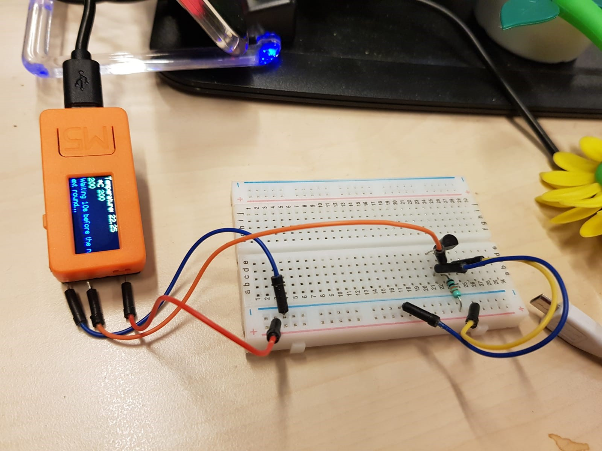

# M5StickC
## M5StickC Projects

### DHT22

This is the M5StickC with the DHT22 temperature and humidity sensor. Replace URL, TOKEN, SSID and matching password

### DS18B20

This is the M5StickC with the DS18B20 temperature sensor. Replace URL, TOKEN, SSID and matching password in config.h

In the picture you see the M5StickC, DS18B20, resistor of 4.7kΩ, cables and a breadboard.

For correct functioning of the sketch use only the Adafruit section of the post. The first http post section is used for a project which uses a specific web service. Delete everything between // BEGIN Block internal use AND // END Block internal use.

#### Explanation

When no connection can be made with the SSID the LED will go on. Also when the http post fails the LED will be tuned on. The following steps have o be made:

1. Make an account at io.adfruit.com, create a feed and click on feed info

Note the API Url:

API	https://io.adafruit.com/api/v2/USERNAEM/feeds/FEEDNAME

You will need that in the config.h file
